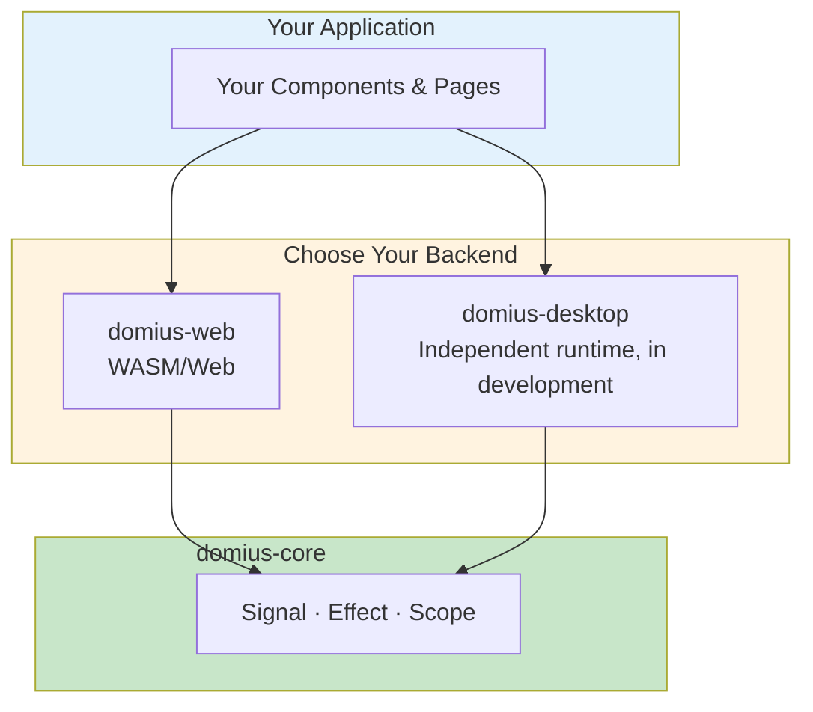
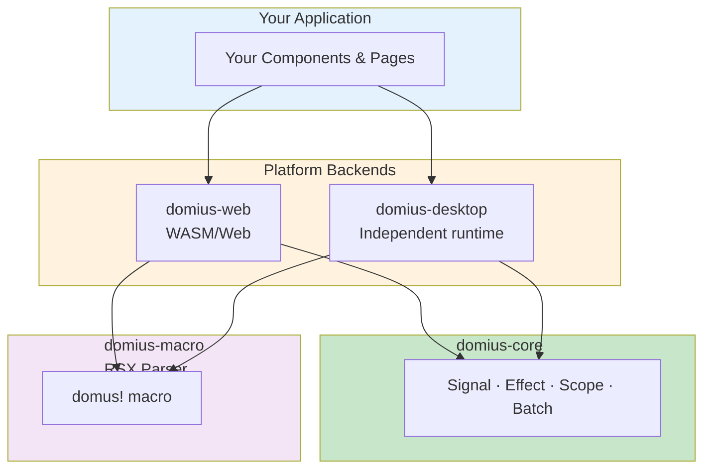
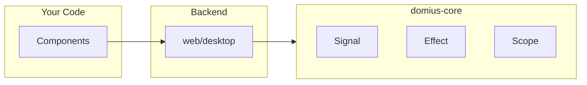
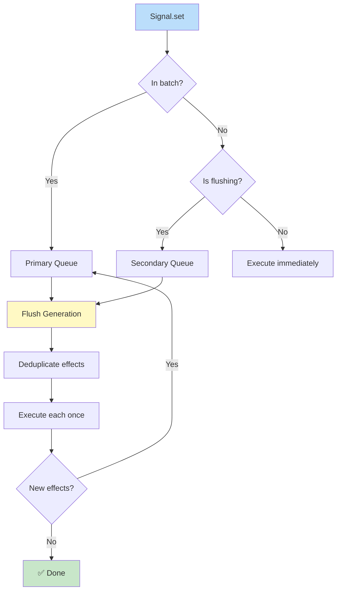
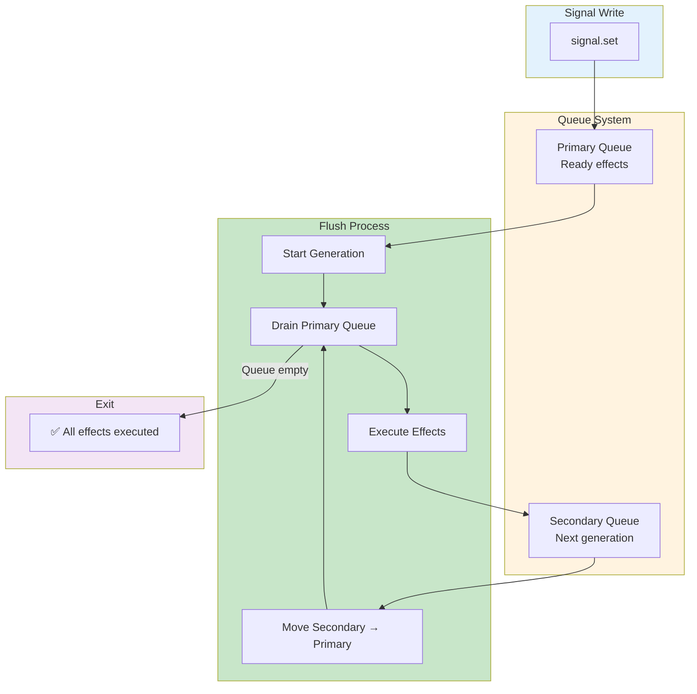
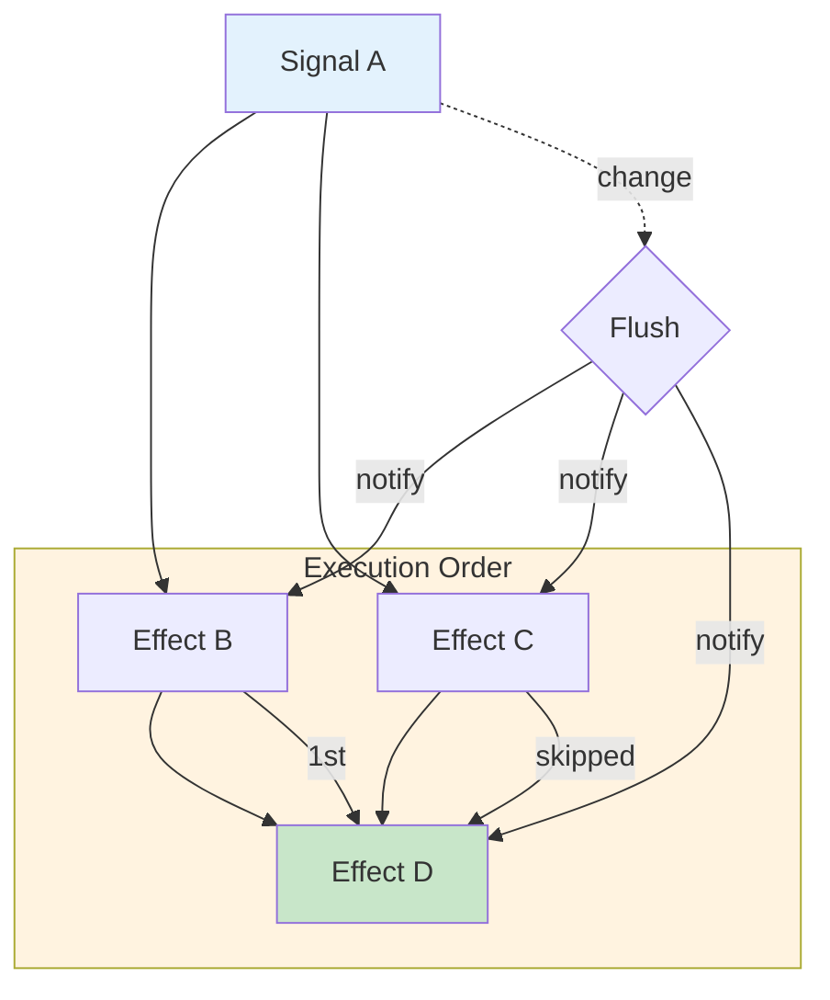
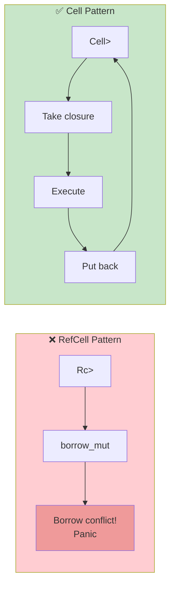

# Domus

**Reactive UI framework for Rust — Web & Desktop**

Build interactive web and desktop applications using only Rust. No JavaScript required.

```
Planning ✅  Development ✅  Testing ✅  Release 🔄
Multi-platform · Alpha v0.1.0
```

---

## Table of Contents

1. [What is Domus?](#what-is-domus) — Introduction for beginners
2. [Quick Start](#quick-start) — Get running in 5 minutes
3. [Your First Component](#your-first-component) — Build something real
4. [Core Concepts](#core-concepts) — Signals, Effects, Batching
5. [Building Applications](#building-applications) — Components, Pages, Router
6. [Architecture](#architecture) — How it works under the hood
7. [Advanced Topics](#advanced-topics) — Context, Lists, Scoped CSS
8. [CLI Reference](#cli-reference) — Scaffold projects quickly
9. [Testing](#testing) — Run the test suite
10. [Roadmap](#roadmap) — What's coming next

---

## What is Domus?

### The Problem

Most UI frameworks for Rust either target only the web (WASM) or require complex JavaScript tooling. Building cross-platform apps usually means maintaining separate codebases.

### The Domus Solution

Domus uses **signals** — a smarter way to track changes. When data changes, only the exact text or element that depends on it updates. Nothing else moves.

Think of it like a spreadsheet:
- Cell A1 contains `5`
- Cell B1 contains `=A1 * 2`
- When you change A1 to `10`, B1 automatically becomes `20`

Domus brings this reactive model to **both web and desktop** UIs with a single codebase.

### Multi-Platform Architecture



### Key Benefits

| Benefit | What it means |
|---------|---------------|
| **Fast** | O(1) updates — changing one signal doesn't re-render the whole page |
| **Small** | No Virtual DOM = less code = smaller bundles |
| **Simple** | Write Rust, not JavaScript. No complex build chains |
| **Precise** | Only the exact node that changed gets updated |
| **Cross-platform model** | The reactive core is shared by Web and the independent desktop runtime |

### When to Use Domus

✅ **Good fit:**
- Dashboards with live data
- Real-time applications
- Projects where you want to avoid JavaScript
- Performance-critical UIs
- Cross-platform apps (web + desktop)

❌ **Not ideal:**
- Static content sites (use a simpler tool)
- Projects requiring heavy JavaScript ecosystem

---

## Quick Start

### Prerequisites

Install these tools first:

```bash
# Rust toolchain (if you don't have it)
curl --proto '=https' --tlsv1.2 -sSf https://sh.rustup.rs | sh

# WASM pack — builds Rust to WASM (for web projects)
cargo install wasm-pack

# Domus CLI — project scaffolding
cargo install domius-cli
```

### Choose Your Platform

#### Web (WASM)

```bash
# Scaffold a new web project
domus new project my-app-web
cd my-app-web

# Build for web (creates a pkg/ folder)
wasm-pack build --target web

# Serve locally (requires Node.js)
npx serve .
```

Open `http://localhost:3000` in your browser.

#### Desktop

The independent Domius desktop runtime is under construction. The current
`domius-desktop` crate exposes platform-neutral component, context, event, and
scope primitives, but does not yet provide a runnable window host or packager.
See `examples/desktop-project-command/README.md` for the implementation contract.

### Project Structure

```
my-app/
├── Cargo.toml          # Rust dependencies
├── index.html          # Web entry point
└── src/
    ├── lib.rs          # Your main Rust code
    └── routes.rs       # URL routing (web) or window management (desktop)
```

### Choosing a Backend in Your Code

In your `Cargo.toml`:

```toml
# For Web
[dependencies]
domius-core = "0.1"      # Reactive core (always required)
domius-web = "0.1"       # Web backend (WASM)

# For Desktop
[dependencies]
domius-core = "0.1"      # Reactive core (always required)
domius-desktop = "0.1"   # Independent desktop runtime foundation (experimental)
```

**Why two crates?**
- `domius-core` — Platform-agnostic reactive runtime (Signal, Effect, Scope). Use this for platform-independent code.
- `domius-web` / `domius-desktop` — Platform-specific backends (DOM manipulation, window management).

In your code:

```rust
// Platform-independent code (shared between web and desktop)
use domius_core::signal::{signal, Signal};
use domius_core::effect::create_effect;

// Platform-specific initialization
#[cfg(target_arch = "wasm32")]
fn main() {
    domius_web::init();
    // ...
}

#[cfg(not(target_arch = "wasm32"))]
fn main() {
    domius_desktop::init();
    // ...
}
```

Your component logic remains the same — only the initialization changes!

---

## Your First Component

Let's build a counter — the "Hello World" of reactive UIs.

### Step 1: Define the Component

Create `src/components/counter/mod.rs`:

```rust
use domius_web::component::{DomusComponent, DomusNode};
use domius_core::signal::signal;

// The component struct (empty — state goes in CounterState)
pub struct Counter;

// Props: data passed from parent
#[derive(Clone)]
pub struct CounterProps {
    pub initial: i32,
}

// State: internal reactive data
pub struct CounterState {
    pub count: Signal<i32>,
    pub set_count: WriteSignal<i32>,
}
```

### Step 2: Setup the State

```rust
impl DomusComponent for Counter {
    type Props = CounterProps;
    type State = CounterState;

    fn setup(props: CounterProps) -> CounterState {
        // Create a signal — a reactive value
        let (count, set_count) = signal(props.initial);
        CounterState { count, set_count }
    }
```

### Step 3: Render the UI

```rust
    fn render(state: &CounterState) -> DomusNode {
        domus! {
            <div class="counter">
                <h2>"Counter"</h2>
                <p>"Count: " {state.count.get()}</p>
                <button on_click={move |_| {
                    let current = state.count.get();
                    state.set_count.set(current + 1);
                }}>
                    "Increment"
                </button>
            </div>
        }
    }
}
```

### Step 4: Mount It

In `src/lib.rs`:

```rust
use domius_web::component::mount_component;
use crate::components::counter::{Counter, CounterProps};

#[wasm_bindgen(start)]
pub fn main() {
    domius_web::init();
    
    let app = document().get_element_by_id("app").unwrap();
    mount_component::<Counter>(&app, CounterProps { initial: 0 });
}
```

### What Happens

1. User clicks "Increment"
2. `set_count.set()` updates the signal
3. Domus automatically re-runs any code that read `count.get()`
4. Only the `<p>` text node updates — nothing else re-renders

---

## Core Concepts

### Signals

A `Signal<T>` is a reactive container. It holds a value and notifies listeners when it changes.

```rust
use domius_core::signal::signal;

// Create a signal
let (count, set_count) = signal(0i32);

// Read the value (tracks dependencies if inside an effect)
let current = count.get();

// Write a new value (notifies all subscribers)
set_count.set(current + 1);
```

**Key insight:** Reading a signal inside an effect automatically registers that effect as a subscriber.

### Effects

An `Effect` runs code whenever its dependent signals change.

```rust
use domius_core::effect::create_effect;

create_effect(move || {
    // This runs once immediately...
    web_sys::console::log_1(&format!("Count: {}", count.get()).into());
    // ...and again every time `count` changes
});
```

Effects are the engine of reactivity. They're used internally by Domus to update the DOM.

### Batching

When you update multiple signals, you can batch them to avoid redundant updates.

```rust
use domius_core::batch::batch;

batch(|| {
    set_x.set(1);
    set_y.set(2);
    set_z.set(3);
    // All effects fire ONCE after the closure returns
});
```

Without batching, each `.set()` would trigger its own round of updates.

### Scopes

A `Scope` groups effects together so they can be cleaned up at once. This prevents memory leaks when components are removed.

```rust
use domius_core::scope::{create_scope, dispose_scope, create_effect_in_scope};

let scope = create_scope(None);

create_effect_in_scope(scope, move || {
    // This effect is tied to the scope
});

// Later, when the component unmounts:
dispose_scope(scope);
// All effects in this scope are automatically unsubscribed
```

**Rule of thumb:** One scope per component. Dispose it when the component unmounts.

---

## Building Applications

### Components

Components are reusable UI building blocks. They follow a simple pattern:

```rust
pub struct MyComponent;

#[derive(Clone)]
pub struct MyComponentProps {
    pub title: String,
}

pub struct MyComponentState {
    // Your reactive state here
}

impl DomusComponent for MyComponent {
    type Props = MyComponentProps;
    type State = MyComponentState;

    fn setup(props: MyComponentProps) -> MyComponentState {
        // Initialize state
    }

    fn render(state: &MyComponentState) -> DomusNode {
        // Return UI
    }
}
```

### Pages

Pages are special components that represent full screens with URLs.

```rust
use domius_web::page::DomusPage;

impl DomusPage for DashboardPage {
    fn route() -> &'static str { "/dashboard" }
    
    fn title(_state: &DashboardState) -> String {
        "Dashboard".into()
    }
}
```

### Router

Navigate between pages with pattern matching.

```rust
use domius_web::router::Router;
use std::collections::HashMap;

let mut router = Router::new();

// Exact match
router.register("/", home_handler);

// With parameters
router.register("/users/:id", user_handler);

// Wildcard
router.register("/files/*", files_handler);

// Match a URL
if let Some((handler, params)) = router.match_route("/users/42") {
    // params["id"] == "42"
    handler(&params);
}
```

### Adding Components and Pages

Use the CLI to scaffold:

```bash
# Add a component
domus add component NavBar
# Creates: src/components/nav_bar/{mod.rs, view.rs, style.css}

# Add a page
domus add page Dashboard
# Creates: src/pages/dashboard/{mod.rs, controller.rs, view.rs, style.css}
```

---

## Architecture

### Multi-Platform Design

Domus uses a layered architecture that separates reactive core from platform-specific backends:



### Crates Overview

| Crate | Purpose | Platform |
|-------|---------|----------|
| `domius-core` | Reactive primitives: `Signal`, `Effect`, `Scope`, `batch` | All |
| `domius-web` | Component system, router, DOM manipulation | Web (WASM) |
| `domius-desktop` | Window component, context, event, and scope foundations | Desktop (experimental) |
| `domius-macro` | RSX proc-macro: parses declarative UI syntax | All |
| `domius-cli` | CLI scaffolding (`domus new`, `domus add`) | All |

### Backend Comparison

| Feature | domius-web | domius-desktop |
|---------|------------|----------------|
| **Target** | WASM in browser | Native desktop process (runtime pending) |
| **Rendering** | `web_sys` APIs | Private platform adapter (pending) |
| **Events** | Browser events | Domius event bridge |
| **Disposal** | `MutationObserver` | Window close events |
| **Bundle** | `.wasm` + JS | Native binary |

### The Reactive Core

The core is identical for both platforms:



### How Dependency Tracking Works

```rust
// 1. Effect starts running
create_effect(move || {
    // 2. Signal.get() checks: "Is there a running effect?"
    //    Yes! Registers this effect as a subscriber
    let value = my_signal.get();
    
    // 3. Effect finishes. Dependencies are now tracked
});

// 4. Later, signal.set() notifies all subscribers
my_signal.set(42);
// Effect re-runs automatically
```

This happens via thread-local storage (TLS) — no manual subscription needed.

### Update Flow

When a signal changes, effects are scheduled and executed efficiently:



**Benefits:**
- ✅ Nested batches work correctly
- ✅ Diamond dependencies execute once (not twice)
- ✅ Glitch-free: derived values see consistent state
- ✅ Re-entrancy safe: epoch system prevents infinite loops

---

## Media Components

Domius provides built-in components for embedding video and audio content.

### Video Player

```rust
use domius_web::components::video_player::{video_player, VideoPlayerProps};

let video = video_player(VideoPlayerProps {
    src: "https://example.com/video.mp4".to_string(),
    controls: true,
    auto_play: false,
    loop_video: false,
    poster: Some("https://example.com/poster.jpg".to_string()),
    class: Some("my-video".to_string()),
});
```

### Audio Player

```rust
use domius_web::components::audio_player::{audio_player, AudioPlayerProps};

let audio = audio_player(AudioPlayerProps {
    src: "https://example.com/audio.mp3".to_string(),
    controls: true,
    auto_play: false,
    loop_audio: false,
    class: Some("my-audio".to_string()),
});
```

### Custom Controls with Signals

For advanced use cases, you can build custom controls using `domius_core` signals:

```rust
use domius_core::signal::{signal, Signal};
use domius_core::effect::create_effect;
use web_sys::HtmlMediaElement;

let (is_playing, set_is_playing) = signal(false);
let (current_time, set_current_time) = signal(0.0);

// Connect to video element
create_effect(move || {
    if is_playing.get() {
        video_element.play().ok();
    } else {
        video_element.pause().ok();
    }
});
```

---

## Advanced Topics

### Context API

Share data across the component tree without passing props everywhere.

```rust
use domius_web::context::{provide_context, use_context};

// Near the root of your app
provide_context(AppConfig {
    theme: "dark".into(),
    lang: "en".into(),
});

// Deep in a child component
if let Some(config) = use_context::<AppConfig>() {
    println!("Theme: {}", config.theme);
}
```

### Keyed Lists

Efficiently update lists by tracking items with unique keys.

```rust
use domius_web::list::{diff_keys, DiffOp};

let old = vec!["a", "b", "c"];
let new = vec!["b", "d", "a"];

let patch = diff_keys(&old, &new);
// patch tells you:
// - Which items to remove
// - Which to keep (and where)
// - Which to insert
```

This is O(N+M) — linear time, not quadratic.

### Scoped CSS

Every component gets its own CSS namespace automatically.

```css
/* Input: src/components/button/style.css */
.btn { color: red; }
.icon { width: 16px; }
```

Gets compiled to:

```css
/* Output */
[data-domus="a3f2b1c0"] .btn { color: red; }
[data-domus="a3f2b1c0"] .icon { width: 16px; }
```

Styles cannot leak between components.

### RSX Macro

The `domus!` macro accepts two syntaxes.

**Rust style:**
```rust
domus! {
    div(class: "card") {
        h2 { "Hello" }
        p { "Count: " {count} }
    }
}
```

**HTML style:**
```rust
domus! {
    <div class="card">
        <h2>Hello</h2>
        <p>Count: {count}</p>
    </div>
}
```

Both compile to the same `web_sys` DOM code.

### Automatic Disposal

When a component's DOM node is removed, its effects are automatically cleaned up.

```rust
// In your component's render:
let root = domus! { <div data-domus-scope={scope_id}>...</div> };

// When this div is removed from the DOM:
// → MutationObserver detects removal
// → Scope is disposed
// → All effects unsubscribe
```

Call `domius_web::init()` once at startup to enable this.

---

## CLI Reference

### Commands

```bash
# Create a new project
domus new project my-app

# Add a component
domus add component NavBar

# Add a page
domus add page Dashboard
```

### Naming Conventions

The CLI auto-converts names:

| You type | File/folder | Rust struct |
|----------|-------------|-------------|
| `NavBar` | `nav_bar/` | `NavBar` |
| `my-page` | `my_page/` | `MyPage` |
| `dashboard` | `dashboard/` | `Dashboard` |

---

## Testing

Run all tests:

```bash
cargo test --workspace
```

Test breakdown:

```
domius-cli   35 tests   CSS scoper · scaffolding · naming
domius-core  19 tests   signals · effects · batching · diamonds
domius-desktop 10 tests components · events · context
domius-macro 38 tests   RSX parsing · codegen
domius-web   78 tests   components · router · context · lists
────────────────────────────────────────────────
            180 native tests + 1 doctest passing
```

Run the 32 browser integration tests with:

```bash
wasm-pack test --headless --chrome domius-web
```

---

## Roadmap

### Current: Alpha (v0.1.0)

**Done:**
- ✅ Signal/Effect reactive core (platform-agnostic)
- ✅ Batch system with nested batches
- ✅ Scope-based disposal
- ✅ Diamond convergence (single execution)
- ✅ Re-entrancy prevention
- ✅ Glitch-free updates
- ✅ RSX parser and code generator tests (Rust + HTML syntax)
- ✅ Component system
- ✅ Page system with routing
- ✅ Context API
- ✅ Keyed list reconciliation
- ✅ Automatic CSS scoping
- ✅ CLI scaffolding
- ✅ Web backend (`domius-web`) with MutationObserver disposal
- ✅ Platform-neutral desktop component, context, event, and scope foundations

**Coming soon:**
- [ ] Connect the public RSX macro to its code generator
- [ ] Implement the independent desktop window and webview runtime
- [ ] Add typed commands and secured frontend/native messaging
- [ ] Add desktop development, build, and packaging commands
- [ ] Publish to crates.io
- [ ] Dev server with file watching
- [ ] Error boundaries
- [ ] Server-side rendering (SSR) / hydration
- [ ] Mobile platform adapters after the desktop runtime is stable

---

## Examples

### Web (WASM)

See `examples/hello-world` for a complete counter + todo list demo (~200 lines).

```bash
cd examples/hello-world
wasm-pack build --target web
npx serve .
```

### Planned full-library applications

- `examples/operations-control-center/README.md` covers the reactive runtime,
  routing, data display, and analytical components.
- `examples/collaborative-media-studio/README.md` covers RSX, components, forms,
  media, hooks, and portals.
- `examples/desktop-project-command/README.md` specifies the independent Domius
  desktop runtime, multi-window events, and CLI contract.

---

## Appendix: Technical Diagrams

### Batch System: Two-Queue Generation Flow

Detailed view of how effects are scheduled and deduplicated:



### Re-entrancy Prevention: Epoch Blocking

How Domus prevents infinite loops when effects write signals:

```mermaid
stateDiagram-v2
    [*] --> Gen1: Generation 1 starts
    
    state Gen1 {
        Exec[⏳ Executing effects]
        Mark[Mark EXECUTED_THIS_GEN]
        Exec --> Mark
    end
    
    Gen1 --> Try{Effect tries to<br/>reschedule?}
    
    Try --> Same: Same epoch
    Try --> Next: Next epoch
    
    Same --> Block[❌ BLOCKED<br/>Already executed]
    Next --> Defer[⏱️ Deferred to<br/>Secondary Queue]
    
    Block --> Gen2
    Defer --> Gen2
    
    Gen2: Generation 2<br/>Process Secondary Queue
    Gen2 --> [*]
    
    style Gen1 fill:#bbdefb
    style Gen2 fill:#bbdefb
    style Block fill:#ffccbc
    style Defer fill:#c8e6c9
```

**Result:** Effects can safely write signals during execution without causing infinite loops.

### Diamond Convergence: Single Execution

When multiple paths lead to the same effect, it executes only once:



**Key insight:** The generation-based flush system tracks which effects have already executed in the current generation, ensuring D runs exactly once.

### Borrow Safety: Cell vs RefCell Pattern

Why Domus uses `Cell<Option<FnMut>>` instead of `RefCell<FnMut>`:



**Why it matters:** `RefCell` panics if you try to borrow mutably while already borrowed. `Cell::take()` avoids this by temporarily removing the value.

---

## License

MIT — use it freely.

---

## Need Help?

- **New to Rust?** Start with [The Rust Book](https://doc.rust-lang.org/book/)
- **New to WASM?** See [Rust and WebAssembly](https://rustwasm.github.io/docs/book/)
- **Found a bug?** Open an issue on GitHub
- **Want to contribute?** Check out the roadmap above
