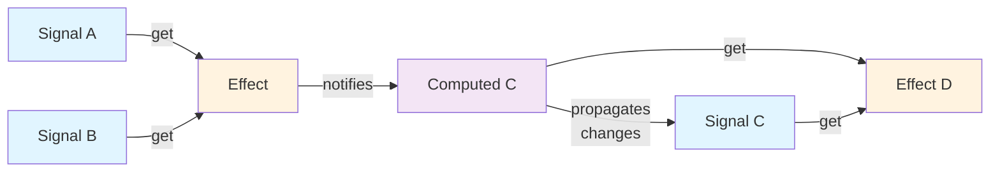
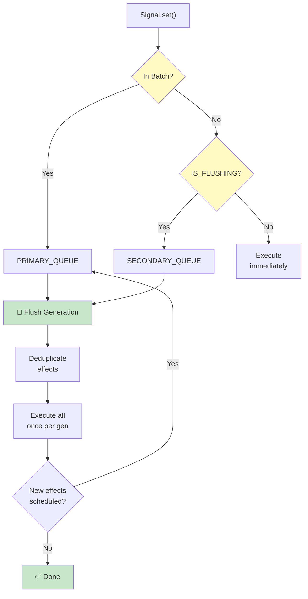
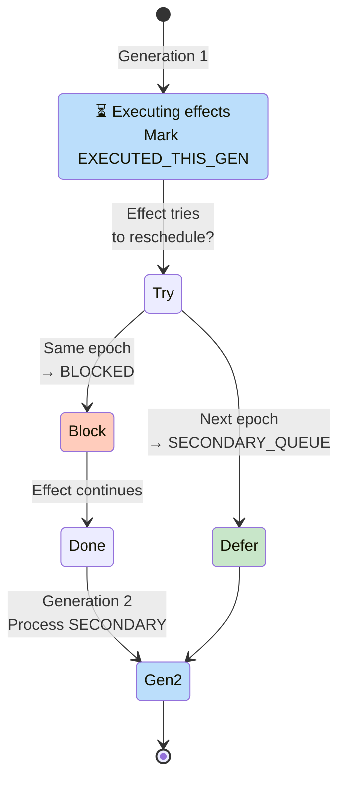
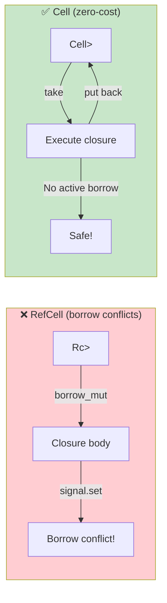

# Domus

Reactive UI framework for Rust/WASM. Fine-grained signals, no Virtual DOM, direct DOM manipulation via `web_sys`.

```
Planning ✅  Development ✅  Testing ✅  Release 🔄
154 tests passing · Alpha
```

---

## Why Domus

Most WASM UI frameworks port a VDOM approach from JavaScript. Domus takes a different path: signals propagate changes directly to the exact DOM nodes that depend on them. No tree diffing, no re-render cycle, no reconciler.

The result is predictable performance — a signal update is O(1) regardless of component tree size — and a small WASM bundle because there is no diffing algorithm to ship.

The framework is written entirely in Rust. The only JavaScript is the `wasm-bindgen` glue generated at compile time.

---

## Architecture

```
┌─────────────────────────────────────────────────────────────┐
│                        Your Application                      │
│              pages/  ·  components/  ·  routes.rs            │
└───────────────────────────┬─────────────────────────────────┘
                            │  DomusComponent / DomusPage traits
┌───────────────────────────▼─────────────────────────────────┐
│                        domus-web                             │
│  component · router · context · list · page · disposal       │
└──────────┬───────────────────────────────────┬──────────────┘
           │  domus_core::signal/effect/scope   │  web_sys DOM
┌──────────▼──────────────┐        ┌───────────▼──────────────┐
│      domus-core          │        │      wasm-bindgen         │
│  Signal · Effect · Scope │        │      web-sys · js-sys     │
└─────────────────────────┘        └──────────────────────────┘
           │
┌──────────▼──────────────┐
│      domus-macro         │
│  RSX parser · codegen    │
└─────────────────────────┘
           │
┌──────────▼──────────────┐
│      domus-cli           │
│  scaffold · css-scoper   │
└─────────────────────────┘
```

### Crates

| Crate | Purpose |
|-------|---------|
| `domus-core` | Reactive primitives: `Signal`, `Effect`, `Scope`, `batch` |
| `domus-macro` | RSX proc-macro: parses declarative UI syntax, emits `web_sys` code |
| `domus-web` | Component system, router, context API, list reconciliation, disposal |
| `domus-cli` | CLI scaffolding (`domus new project`, `domus add component/page`), scoped CSS |

---

## Installation

```toml
# Cargo.toml
[lib]
crate-type = ["cdylib"]

[dependencies]
domus-web  = "0.1"
domus-core = "0.1"
wasm-bindgen = "0.2"
web-sys = { version = "0.3", features = ["Window", "Document", "Element", "Node"] }
```

```bash
cargo install wasm-pack domus-cli
```

---

## Quick Start

```bash
domus new project my-app
cd my-app
wasm-pack build --target web
npx serve .
```

Generated project structure:

```
my-app/
├── Cargo.toml
├── index.html
└── src/
    ├── lib.rs        # wasm_bindgen entry point
    └── routes.rs     # route registration
```

Add components and pages as the project grows:

```bash
domus add component NavBar
# → src/components/nav_bar/{mod,view,style}.rs

domus add page Dashboard
# → src/pages/dashboard/{mod,controller,view,style}.rs
```

---

## Core Concepts

### Signals

A `Signal<T>` is a reactive cell. Reading it inside an effect registers a dependency; writing it notifies all dependent effects.

```rust
use domus_core::signal::signal;

let (count, set_count) = signal(0i32);

let current = count.get();   // read — tracks if inside an effect
set_count.set(current + 1);  // write — triggers subscribers
```

### Effects

An `Effect` re-runs its closure whenever any signal read during the previous run changes.

```rust
use domus_core::effect::create_effect;

create_effect(move || {
    // runs once immediately, then again on every change
    web_sys::console::log_1(&count.get().into());
});
```

Dependency tracking is automatic and precise. Only the signals actually read in the last run are tracked.

### Batching

Multiple signal writes in one batch trigger each downstream effect at most once.

```rust
use domus_core::batch::batch;

batch(|| {
    set_x.set(1);
    set_y.set(2);
    set_z.set(3);
    // effects fire once, after the closure returns
});
```

### Scopes

A `Scope` groups effects so they can be disposed together. This is how Domus prevents memory leaks when components unmount.

```rust
use domus_core::scope::{create_scope, dispose_scope, create_effect_in_scope};

let scope = create_scope(None);

create_effect_in_scope(scope, move || {
    // reactive work tied to this scope
});

// When the component unmounts:
dispose_scope(scope);
// All effects in the scope are unsubscribed from their signals.
```

Scopes can be nested. Disposing a parent disposes all children.

---

## Reactive System Architecture

### Dependency Graph: Signals → Effects → Computed



**How it works:**
1. Effects read signals → dependencies are tracked automatically
2. Signal changes notify all dependent effects
3. Computed values are signals that auto-update when their sources change
4. No manual tracking; no Virtual DOM diffing

### Batch Execution: Two-Queue Generation System



**Benefits:**
- ✅ Nested batches work correctly (only flush at outermost exit)
- ✅ Diamond dependencies execute effects once, not twice
- ✅ Glitch-free: derived values see consistent state
- ✅ Re-entrancy safe: epoch system prevents infinite loops

### Re-entrancy Prevention: Epoch Blocking



**Result:** Effects can safely write signals during execution without causing infinite loops.

### Borrow Safety: Cell Pattern



---

## Components

The `DomusComponent` trait separates setup (state construction) from render (DOM building).

```rust
use domus_web::component::{DomusComponent, DomusNode};
use domus_core::signal::signal;

pub struct Counter;

#[derive(Clone)]
pub struct CounterProps {
    pub initial: i32,
}

pub struct CounterState {
    pub count: Signal<i32>,
    pub set_count: WriteSignal<i32>,
}

impl DomusComponent for Counter {
    type Props = CounterProps;
    type State = CounterState;

    fn setup(props: CounterProps) -> CounterState {
        let (count, set_count) = signal(props.initial);
        CounterState { count, set_count }
    }

    fn render(state: &CounterState) -> DomusNode {
        let el = document().create_element("div").unwrap();
        // build DOM, attach effects, return root element
        el
    }
}
```

`mount_component` wires setup → render → DOM insertion:

```rust
use domus_web::component::mount_component;

let app = document().get_element_by_id("app").unwrap();
mount_component::<Counter>(&app, CounterProps { initial: 0 });
```

---

## Pages

`DomusPage` extends `DomusComponent` with a route and a title.

```rust
use domus_web::page::DomusPage;

impl DomusPage for DashboardPage {
    fn route() -> &'static str { "/dashboard" }
    fn title(_state: &DashboardState) -> String { "Dashboard".into() }
}
```

---

## Router

Pattern matching over URL paths. Supports exact segments, named parameters (`:id`), and wildcards (`*`).

```rust
use domus_web::router::Router;
use std::collections::HashMap;

let mut router: Router<fn(&HashMap<String, String>)> = Router::new();
router.register("/",            home_handler);
router.register("/users/:id",   user_handler);
router.register("/files/*",     files_handler);

if let Some((handler, params)) = router.match_route("/users/42") {
    // params["id"] == "42"
    handler(&params);
}
```

`RoutePattern` compiles each pattern into a `Vec<Segment>` at registration time; matching is a linear scan with no allocations beyond the params map.

---

## Context API

Pass values down the tree without threading them through props.

```rust
use domus_web::context::{provide_context, use_context, has_context, remove_context};

// Near the root:
provide_context(AppConfig { theme: "dark".into(), lang: "en".into() });

// Anywhere below:
if let Some(config) = use_context::<AppConfig>() {
    // config.theme == "dark"
}
```

The registry is keyed by `TypeId`. Each type can have at most one active context value.

---

## List Reconciliation

`diff_keys` computes the minimal patch to transform an old keyed list into a new one, in O(N+M).

```rust
use domus_web::list::{diff_keys, DiffOp};

let old = vec!["a", "b", "c"];
let new = vec!["b", "d", "a"];

let patch = diff_keys(&old, &new);
// patch.removes — indices to remove from old list
// patch.ops     — Keep(old_index) | Insert for each position in new list
```

Apply the patch to DOM nodes to perform surgical updates without re-rendering the whole list.

---

## Scoped CSS

Every component gets a deterministic `[data-domus="<hash>"]` attribute selector derived from its file path and CSS content. Styles cannot bleed between components.

```rust
use domus_cli::css_scoper::{generate_scope_hash, scope_css, scope_attr};

let css = r#"
    .btn  { color: red; }
    .icon { width: 16px; }
    .a, .b { display: flex; }
    @media (max-width: 768px) { .btn { display: none; } }
"#;

let hash   = generate_scope_hash("src/components/button/view.rs", css);
let scoped = scope_css(css, &hash);
```

Output:

```css
[data-domus="a3f2b1c0"] .btn  { color: red; }
[data-domus="a3f2b1c0"] .icon { width: 16px; }
[data-domus="a3f2b1c0"] .a, [data-domus="a3f2b1c0"] .b { display: flex; }
@media (max-width: 768px) { .btn { display: none; } }
```

At-rules (`@media`, `@keyframes`) are passed through unchanged. Comments are stripped. Comma-separated selectors are each prefixed individually.

---

## Automatic Disposal

`domus_web::init()` (called once from `wasm_bindgen(start)`) installs a `MutationObserver` on the document. When a node carrying a `data-domus-scope` attribute is removed from the DOM, the corresponding scope is automatically disposed and all its effects unsubscribed.

```rust
#[wasm_bindgen(start)]
pub fn main() {
    domus_web::init(); // installs MutationObserver
    // mount root component
}
```

Set the attribute on component root elements:

```rust
root_el.set_attribute("data-domus-scope", &scope_id.to_string()).unwrap();
```

---

## RSX Macro

`domus!` accepts both a Rust-style and an HTML-style syntax and emits `web_sys` DOM construction code.

Rust style:

```rust
domus! {
    div(class: "card") {
        h2 { "Hello" }
        p  { "Count: " {count} }
        button(on_click: move |_| set_count.set(count.get() + 1)) {
            "Increment"
        }
    }
}
```

HTML style:

```rust
domus! {
    <div class="card">
        <h2>Hello</h2>
        <p>Count: {count}</p>
        <button on_click={move |_| set_count.set(count.get() + 1)}>Increment</button>
    </div>
}
```

Dynamic expressions (`{count}`) compile to a `create_effect` that updates a text node. Event attributes compile to `wasm_bindgen::Closure` + `set_onclick` (or `set_oninput`, `set_onchange`, etc.) + `forget()`.

---

## hello-world example

A counter and a todo list, demonstrating all core features in under 200 lines.

```bash
cd examples/hello-world
wasm-pack build --target web
npx serve .
```

Features shown: signal creation, `create_effect` for live DOM updates, `Closure` event handlers, scope markers, list add/remove.

---

## CLI Reference

```
domus new project <name>      Scaffold a new project
domus add component <name>    Add a component (mod + view + CSS)
domus add page <name>         Add a page (mod + controller + view + CSS)
```

Generated names follow conventions automatically:

| Input | snake_case | PascalCase |
|-------|-----------|------------|
| `NavBar` | `nav_bar` | `NavBar` |
| `my-page` | `my_page` | `MyPage` |
| `dashboard` | `dashboard` | `Dashboard` |

---

## Tests

```bash
cargo test --workspace --exclude hello-world
```

```
domus-cli   35 tests   css scoper · scaffold · naming helpers
domus-core  19 tests   signal · effect · scope · batch · computed
                      → dynamic deps · diamonds · glitch-free · re-entrancy
domus-macro 38 tests   RSX parser · codegen · event handlers
domus-web   62 tests   component · router · context · list · page
─────────────────────────────────────────────────
            154 tests  0 failed
```

All tests run on native (no WASM runtime needed). WASM-only code (`MutationObserver`, DOM APIs) is gated behind `#[cfg(target_arch = "wasm32")]` with no-op stubs for testing.

---

## Project Structure (generated app)

```
my-app/
├── Cargo.toml
├── index.html
└── src/
    ├── lib.rs
    ├── routes.rs
    ├── components/
    │   └── nav_bar/
    │       ├── mod.rs
    │       ├── view.rs
    │       └── style.css
    └── pages/
        └── dashboard/
            ├── mod.rs
            ├── controller.rs   ← reactive state setup
            ├── view.rs         ← DomusComponent + DomusPage impls
            └── style.css
```

---

## Roadmap

- [ ] `cargo clippy` clean pass
- [ ] `cargo doc --no-deps` public API docs
- [ ] `v0.1.0-alpha` tag + crates.io publish
- [ ] Dev server (`domus dev` with file watch + wasm-pack rebuild)
- [ ] `domus build --release` with wasm-opt pass
- [ ] Error boundaries
- [ ] SSR / hydration

---

## License

MIT
